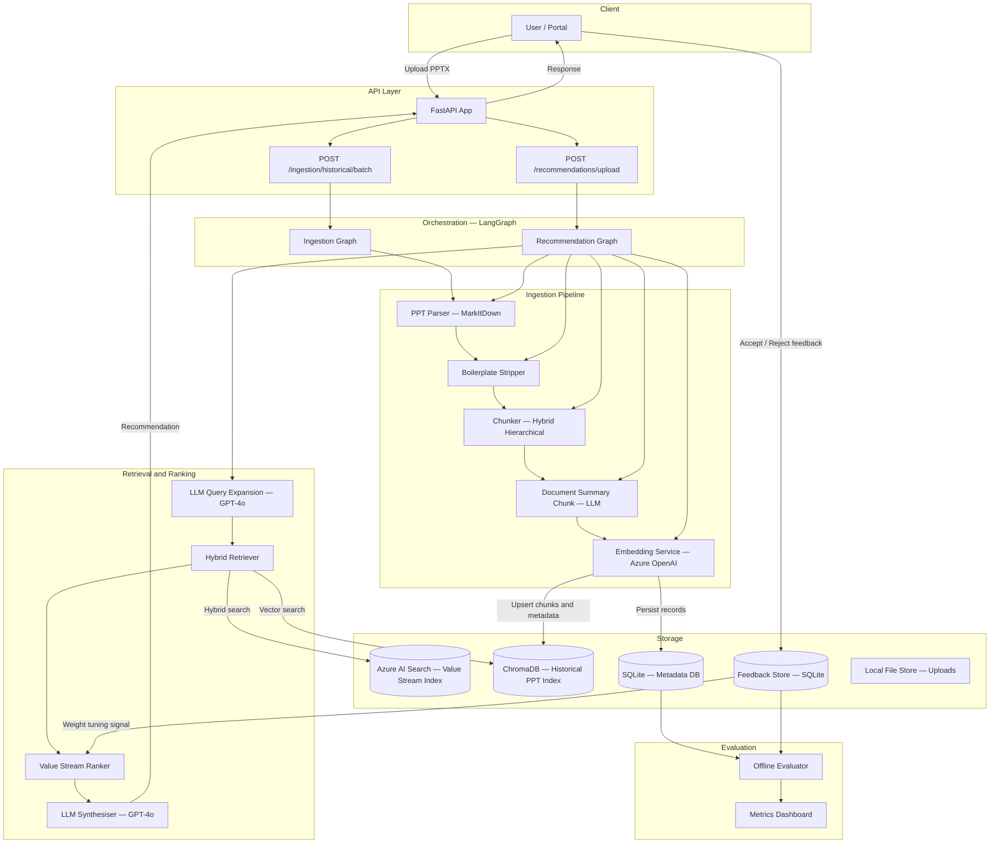
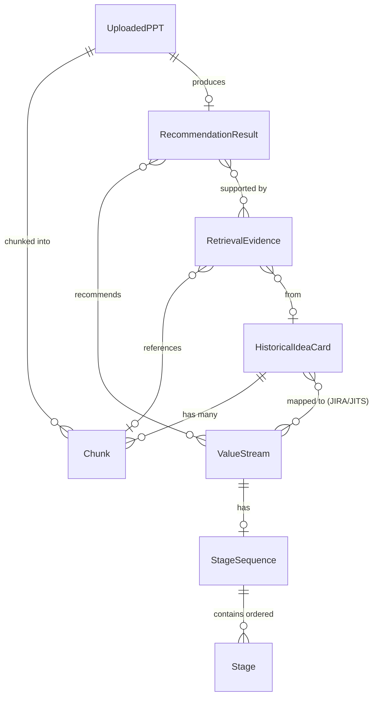
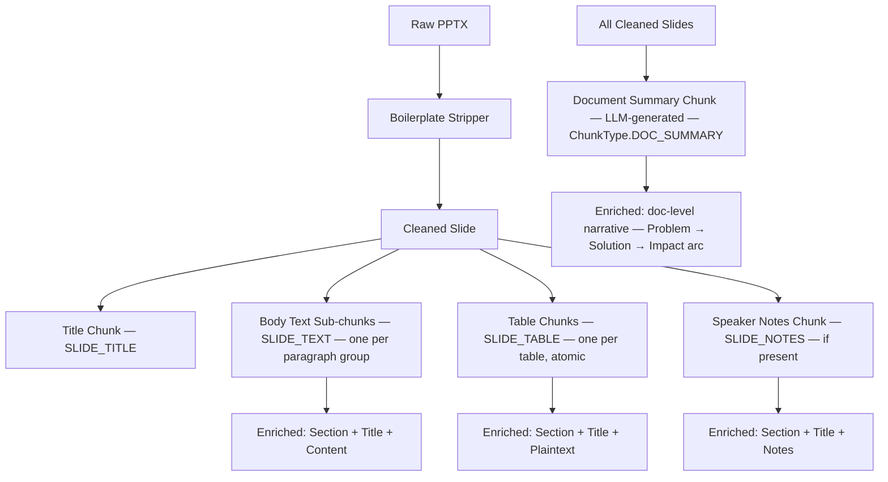
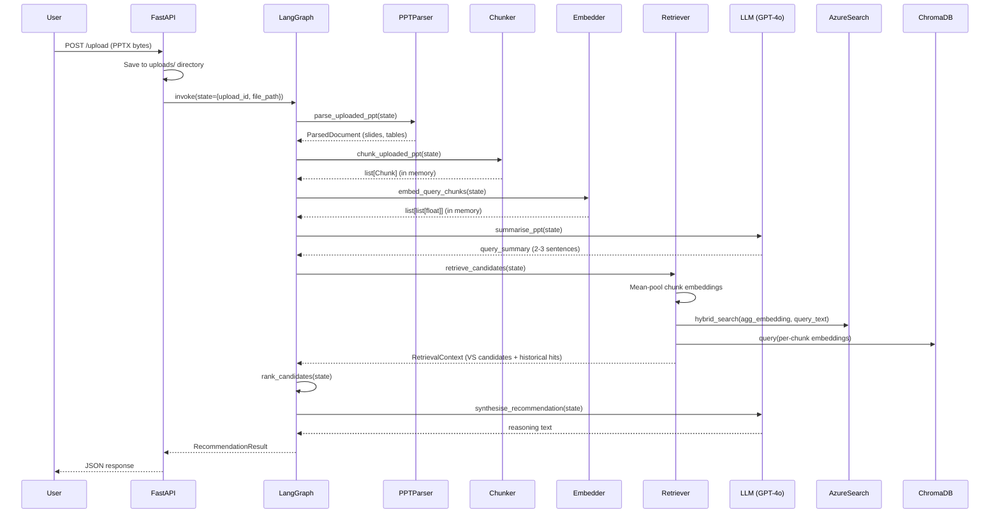
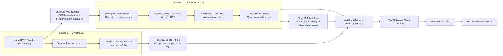
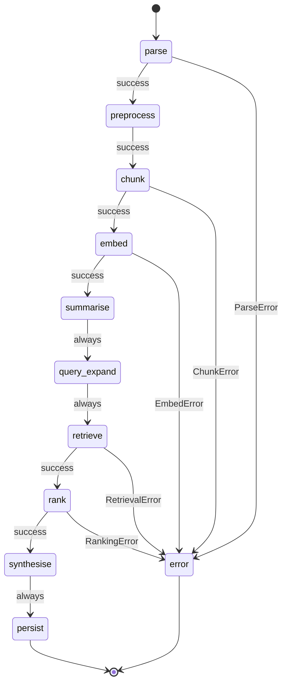
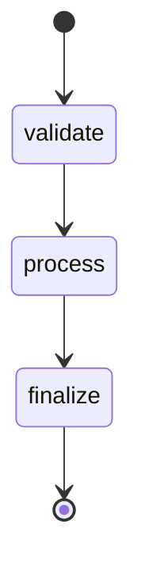
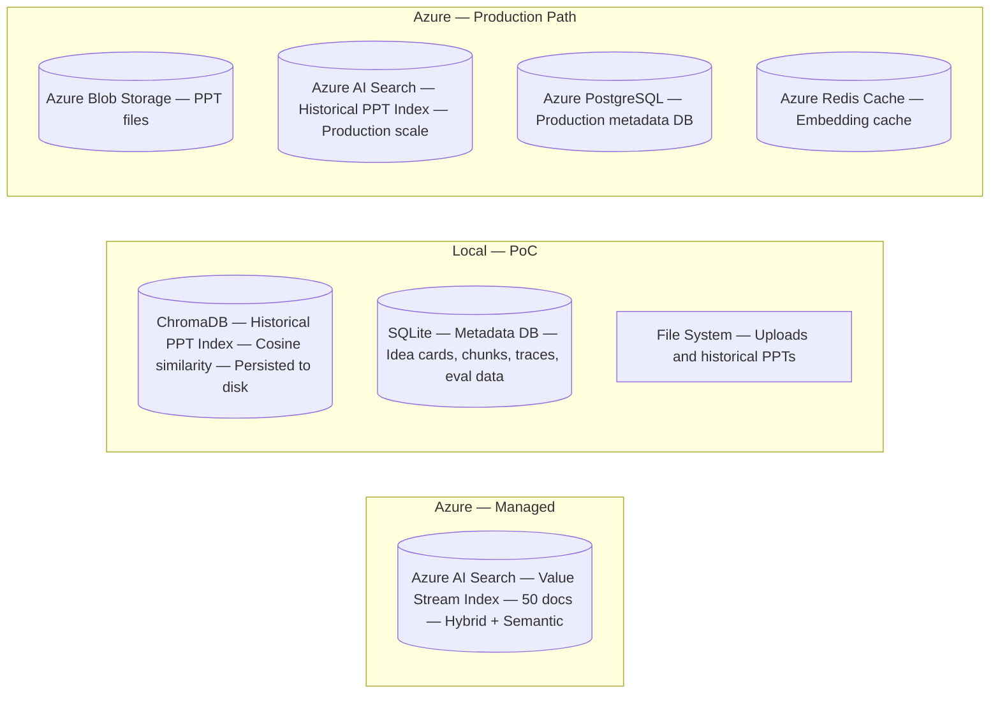

# Value Stream RAG – Complete Architecture Documentation

> **Enterprise RAG System for Value Stream Recommendation from Idea-Card PowerPoints**
>
> Version: 0.1.0 | Status: PoC → Production Path

---

## Table of Contents

1. [Executive Summary](#1-executive-summary)
2. [Problem Framing](#2-problem-framing)
3. [Recommended Architecture](#3-recommended-architecture)
4. [Data Model Design](#4-data-model-design)
5. [Chunking Strategy](#5-chunking-strategy)
6. [Handling User-Uploaded PPTs](#6-handling-user-uploaded-ppts)
7. [Retrieval and Recommendation Strategy](#7-retrieval-and-recommendation-strategy)
8. [LangGraph Workflow Design](#8-langgraph-workflow-design)
9. [Python Project Structure](#9-python-project-structure)
10. [Implementation Plan](#10-implementation-plan)
11. [API Design](#11-api-design)
12. [Storage and Index Design](#12-storage-and-index-design)
13. [Design Decisions and Tradeoffs](#13-design-decisions-and-tradeoffs)
14. [Evaluation Framework](#14-evaluation-framework)
15. [Production Considerations](#15-production-considerations)
16. [Best Practices Research](#16-best-practices-research)

---

## 1. Executive Summary

### What the System Does

The Value Stream RAG system accepts an uploaded PowerPoint idea-card and recommends the most relevant Value Streams from a catalogue of ~50, ranked by semantic relevance, historical precedent, and stage-level keyword alignment.

### End-to-End Pipeline

```
User uploads PPTX
        │
        ▼
  Parse PPT (MarkItDown)
  ─ Extract text per slide
  ─ Detect and parse tables
  ─ Annotate sections
        │
        ▼
  Chunk Document (Hybrid Hierarchical)
  ─ Title chunks (slide titles)
  ─ Text sub-chunks (paragraphs)
  ─ Table chunks (atomic, never split)
        │
        ▼
  Embed Chunks (Azure OpenAI text-embedding-3-large)
        │
        ├──────────────────────────────────────┐
        │                                      │
        ▼                                      ▼
  Azure AI Search                       ChromaDB
  (Value Stream Index)            (Historical PPT Index)
  ─ Hybrid search (BM25 + vector)  ─ Vector search
  ─ Semantic reranking             ─ Returns chunks with
  ─ Returns top-K VS candidates      mapped VS IDs
        │                                      │
        └──────────────────────────────────────┘
                          │
                          ▼
                  Rank & Score
                  ─ VS similarity score
                  ─ Historical boost score
                  ─ Stage keyword overlap
                  ─ Rerank score
                          │
                          ▼
              LLM Reasoning (GPT-4o)
              ─ Summarise uploaded PPT
              ─ Generate explanation
                          │
                          ▼
              Recommendation Result
              ─ Ranked Value Streams
              ─ Evidence per VS
              ─ Natural language reasoning
              ─ Confidence score
```

---

## 2. Problem Framing

### Business Problem

Enterprise idea-card PPTs must be manually triaged and mapped to Value Streams – a process that is slow, inconsistent, and dependent on domain expert availability. The goal is to automate this mapping using AI.

### Core Technical Challenges

| Challenge | Complexity | Approach |
|-----------|-----------|----------|
| PPT parsing (text + tables) | Medium | MarkItDown with table detection post-processing |
| Chunking strategy | High | Hybrid Hierarchical – atomic tables, paragraph-level text |
| Hierarchical chunking feasibility | Medium | Suitable; implemented as parent/sub-chunk pattern |
| Runtime uploaded PPT handling | Medium | In-memory chunks (not re-indexed); re-embedded per request |
| Using historical PPTs effectively | High | Ingest into ChromaDB with VS IDs as metadata |
| Matching Value Streams accurately | High | Multi-source retrieval + weighted ranking |
| Explainability | Medium | LLM-generated reasoning + evidence chains |

### Key Assumptions

- The Azure AI Search Value Stream index is **pre-built and maintained externally**. This system is read-only with respect to that index.
- Historical PPTs are available as local files with a **manifest** that maps each PPT to one or more JIRA/JITS ticket VS IDs.
- ~50 Value Streams means retrieval is not primarily a scale problem – accuracy and ranking quality are the main concerns.

---

## 3. Recommended Architecture

### System Architecture Diagram



### Component Responsibilities

| Component | Responsibility |
|-----------|---------------|
| **FastAPI** | HTTP layer, file upload handling, request/response validation |
| **LangGraph** | Stateful workflow orchestration, retry logic, conditional routing |
| **PPTParser** | MarkItDown-based PPTX → per-slide structured data |
| **BoilerplateStripper** | Remove slide numbers, copyright footers, and template placeholders before chunking |
| **PPTChunker** | Convert slides to atomic Chunk objects; includes a document-level LLM summary chunk |
| **EmbeddingService** | Azure OpenAI / OpenAI text-embedding-3-large API wrapper |
| **AzureValueStreamSearcher** | Read-only hybrid/semantic search against VS index |
| **ChromaVectorStore** | Local vector store for historical PPT chunks |
| **LLMQueryExpander** | GPT-4o pre-retrieval node: reads parsed slides and emits a structured query (domain, problem type, expected outcomes) |
| **HybridRetriever** | Orchestrates multi-source retrieval, aggregates embeddings |
| **ValueStreamRanker** | Weighted scoring across VS sim + historical boost (with decay) + stage signals + diversity penalty |
| **SynthesisNodes** | GPT-4o for PPT summarisation and recommendation reasoning |
| **SQLite / ORM** | Audit trail, ingestion job tracking, evaluation ground truth |
| **FeedbackStore** | Persists accept/reject signals per recommendation; drives weight-tuning and historical index quality review |

### Single-Index vs Multi-Index Decision

**Recommendation: Multi-Index**

| Aspect | Single-Index | Multi-Index (chosen) |
|--------|-------------|----------------------|
| Simplicity | Simpler queries | Slightly more complex |
| Schema flexibility | Rigid shared schema | Each index optimised independently |
| Query isolation | Hard to separate VS vs historical signals | Clean separation; different retrieval strategies per source |
| Scalability | Mixing concerns limits tuning | Can scale each index independently |
| Azure AI Search cost | One managed index | One Azure index (VS) + local Chroma (historical) – cost-effective at PoC scale |

---

## 4. Data Model Design

### Entity Relationship Diagram



### Key Data Models

#### ValueStream
```python
ValueStream(
    id: str,                        # Primary key in Azure AI Search
    name: str,                      # "Order Management Value Stream"
    description: str,               # Rich text description
    domain: str,                    # Business domain / tribe
    keywords: list[str],            # Searchable terms
    stage_sequence: StageSequence,  # Ordered stages
    properties: dict,               # Additional Azure index fields
    similarity_score: float,        # Set at retrieval time
    rerank_score: float,            # Set after semantic reranking
    final_score: float,             # Set after weighted ranking
)
```

#### Chunk (atomic embedding unit)
```python
Chunk(
    id: UUID,
    source_document_id: str,        # Historical card ID or upload ID
    source_document_path: str,
    slide_index: int,
    slide_title: str,
    chunk_type: ChunkType,          # SLIDE_TITLE | SLIDE_TEXT | SLIDE_TABLE | SLIDE_NOTES
    content: str,                   # Raw text
    enriched_content: str,          # "[Section: X] | Slide: Y\ncontent" — embedded
    token_count: int,
    table_index: int | None,        # For table chunks
    table_headers: list[str],
    section_label: str,             # Inferred section (Problem, Solution, etc.)
)
```

#### RetrievalEvidence (full traceability)
```python
RetrievalEvidence(
    chunk_id: str,
    chunk_content: str,
    chunk_type: ChunkType,
    slide_index: int,
    slide_title: str,
    source_document_id: str,
    source_document_path: str,
    historical_card_id: str | None,       # If from historical index
    historical_mapped_vs_ids: list[str],  # Gold VS IDs of that historical card
    evidence_source: EvidenceSource,      # VALUE_STREAM_INDEX | HISTORICAL_PPT_INDEX
    similarity_score: float,
    rerank_score: float | None,
)
```

### Metadata Traceability Chain

```
RecommendationResult
  → evidence_by_value_stream["VS001"]
      → RetrievalEvidence
          → chunk_id = "abc-123"
          → historical_card_id = "card-456"      ← links to historical card
          → historical_mapped_vs_ids = ["VS001"]  ← gold truth from JIRA
          → source_document_path = "data/historical_ppts/idea_card_456.pptx"
          → slide_index = 2
          → slide_title = "Problem Statement"
```

This chain allows every recommendation to be fully explained and audited.

---

## 5. Chunking Strategy

### Strategy Comparison

| Strategy | Pros | Cons | Best For |
|----------|------|------|---------|
| **Slide-level** | Simple, one chunk per slide | Text and tables mixed; precision loss | Quick PoC, short slides |
| **Table-aware** | Tables are atomic; text separate | No hierarchy; no parent context | Any slides with tables |
| **Semantic** | Chunk at natural language boundaries | Slower; needs LLM or sentence splitter | Long narrative slides |
| **Hybrid Hierarchical** ✅ | Best of all; context preserved; tables atomic; fine-grained retrieval | Slightly more chunks | **Recommended** |

### Recommended: Hybrid Hierarchical Chunking



#### Preprocessing: Boilerplate Stripping

Before chunking, a `BoilerplateStripper` pass removes content that degrades embedding quality:

- Slide numbers and page footers (regex: `^\d+$`, `Page \d+ of \d+`)
- Copyright lines (regex: `©`, `All rights reserved`, `Confidential`)
- Template placeholders (`Click to add text`, `[Title]`, `[Subtitle]`)
- Repeated masthead / logo text that appears on every slide

This is especially important for corporate deck templates where 30–40% of tokens on a slide can be boilerplate.

#### Document-Level Summary Chunk

After per-slide chunking, one additional **`DOC_SUMMARY`** chunk is generated per document using an LLM call:

```
Prompt: "Summarise this idea card in 3–5 sentences. Identify the core problem,
the proposed solution, the expected business outcome, and the domain/function.
Output plain prose."
```

This chunk:
- Captures the **Problem → Solution → Impact narrative arc** that per-slide chunks lose.
- Serves as a **high-recall anchor**: when individual slide chunks score poorly, the summary chunk often provides a stronger semantic match against the VS descriptions.
- Is stored with `chunk_type = DOC_SUMMARY` and always included as an additional query vector.

#### Why Hierarchical?

1. **Tables must be atomic.** Splitting a table row across chunks destroys the key-value relationship. A single table chunk is always complete.
2. **Title context injection.** Every sub-chunk has its parent slide's title prepended in `enriched_content`. This prevents the "orphan paragraph" problem where a retrieved chunk is incomprehensible without context.
3. **Granular retrieval.** Small text sub-chunks match precise concept-level queries; table chunks match numerical/structured queries; title chunks catch high-level topic queries.
4. **Section labels.** Heuristic section annotation (Problem, Solution, Metrics, etc.) enables metadata-filtered retrieval at inference time.
5. **Document summary chunk.** One LLM-generated summary per document captures cross-slide narrative that fine-grained chunks miss.

#### Token Budget

| Chunk Type | Max Tokens | Notes |
|-----------|------------|-------|
| SLIDE_TITLE | 128 | Title only; always short |
| SLIDE_TEXT | 512 | Paragraph-grouped; overlapping windows if long |
| SLIDE_TABLE | 512 | Truncated if needed; headers always included |
| SLIDE_NOTES | 256 | Half budget; notes are supplementary |
| DOC_SUMMARY | 384 | LLM-generated per document; captures cross-slide narrative |

#### Enriched Content Format

```
[Section: Problem Statement] | Slide: Order Fulfilment Gap Analysis
We are experiencing a critical bottleneck in our order management process.
This results in a 3-day SLA breach affecting 15% of orders.
```

#### Offline vs Runtime Chunking

| Scenario | Chunking Mode | Persistence |
|----------|--------------|-------------|
| Historical PPT batch ingestion | Hybrid Hierarchical | Indexed in ChromaDB + SQLite |
| Runtime uploaded PPT | Hybrid Hierarchical | **In-memory only** (not indexed) |

Runtime chunks are **not indexed** into ChromaDB because:
- The uploaded PPT is a one-time query, not ground truth.
- Indexing would pollute the historical retrieval pool.
- Latency is acceptable for in-memory embedding of ~20–50 chunks.

---

## 6. Handling User-Uploaded PPTs

### Runtime Processing Flow



### Temporary vs Persistent vs In-Memory: Decision Matrix

| Option | Latency | Cost | Maintainability | Recommended? |
|--------|---------|------|----------------|--------------|
| **In-memory** (chunks embedded, not indexed) | Low | Lowest | Simple | ✅ **Yes, for PoC and runtime** |
| Temporarily index, then delete | Medium | Medium | Complex | Only if multi-turn queries needed |
| Permanently index | High startup | Ongoing cost | Complex | Only if building a feedback loop that learns from uploaded PPTs |

**Chosen approach:** In-memory. Chunks from uploaded PPTs are embedded and used directly for retrieval queries, but never written to ChromaDB or Azure AI Search.

---

## 7. Retrieval and Recommendation Strategy

### Multi-Step Retrieval Strategy



### Pre-Retrieval: LLM Query Expansion

Before retrieval, a **`query_expand` node** reads the parsed slides and doc summary and asks GPT-4o to produce a structured query:

```
Prompt: "Given the following idea card content, identify:
1. The primary business domain (e.g. Supply Chain, Finance, HR)
2. The core problem type (e.g. process automation, cost reduction, compliance)
3. The expected business outcomes (e.g. 20% FTE reduction, SLA improvement)
4. Any explicit Value Stream or capability keywords mentioned.
Output as JSON."
```

This structured output replaces or augments raw slide text as the retrieval query, giving both the BM25 and vector retrievers much higher-quality input than mean-pooled noise-heavy slide embeddings.

### Evidence Combination

| Signal | Weight | Description |
|--------|--------|-------------|
| `vs_similarity_score` | 0.40 | Azure AI Search hybrid score for direct VS match |
| `historical_boost_score` | 0.35 | Time-decayed similarity of historical chunks referencing this VS |
| `rerank_score` | 0.15 | Azure semantic ranker or cross-encoder score |
| `stage_match_score` | 0.10 | **Soft match**: embedding similarity between PPT content and VS stage descriptions |

**Weights are configurable** in `RankingConfig` and are candidates for learned optimisation once feedback data is available (see Decision 5 and Section 17).

### Historical Boost Calculation

```python
# Time-decay factor: recent mappings weighted higher
DECAY_HALFLIFE_DAYS = 180
decay = 0.5 ** ((now - mapping.created_at).days / DECAY_HALFLIFE_DAYS)

boost[vs_id] = min(1.0, (mean_similarity * decay) * (1 + 0.1 * log(hit_count + 1)))
```

This formula rewards:
- High average semantic similarity between the uploaded PPT and historical cards mapped to this VS.
- Consensus: if many historical cards agree (high `hit_count`), the boost increases logarithmically.
- **Recency:** mappings older than ~6 months decay toward zero, preventing the system from entrenching early biases or over-rewarding historically popular Value Streams.

### Stage Soft Matching

Instead of lexical keyword overlap, stage matching now uses **embedding similarity**:

```python
stage_match_score[vs_id] = cosine_similarity(
    mean(chunk_embeddings),
    mean(embed(stage.description) for stage in vs.stages)
)
```

This avoids false positives from domain-ambiguous terms (e.g. "Discovery" in pharma vs. software contexts) and false negatives from synonym variation. VS stage descriptions are pre-embedded and cached at startup.

### Diversity Penalty

To prevent the ranked list collapsing onto 5–6 dominant Value Streams:

```python
# Penalise VS if a closely related VS is already ranked above it
diversity_penalty[vs_id] = max(
    cosine_similarity(embed(vs), embed(already_ranked_vs))
    for already_ranked_vs in ranked_above
)
final_score[vs_id] = raw_score[vs_id] * (1 - 0.3 * diversity_penalty[vs_id])
```

The penalty factor (0.3) is configurable in `RankingConfig`. This ensures the long tail of ~50 Value Streams is surfaced when relevant.

### Confidence Thresholding

The `confidence_score` returned in the API response is calibrated, not just a rescaled similarity:

| Confidence Tier | Score Range | Response behaviour |
|----------------|-------------|-------------------|
| **High** | ≥ 0.75 | Return top recommendation with full reasoning |
| **Medium** | 0.50 – 0.74 | Return top 3 with a caveat note |
| **Low** | < 0.50 | Return `"no_strong_match"` signal; still provide best-effort candidates |

This prevents users from over-trusting marginal results.

---

## 8. LangGraph Workflow Design

### Recommendation Workflow



### State Schema

```python
class RecommendationState(TypedDict, total=False):
    # Input
    upload_id: str
    file_path: str
    original_filename: str
    domain_hint: str | None

    # Parsing & chunking
    uploaded_ppt: UploadedPPT
    query_chunks: list[Chunk]
    chunk_embeddings: list[list[float]]

    # Query synthesis
    query_summary: str
    expanded_query: ExpandedQuery  # LLM-structured: domain, problem_type, outcomes, keywords

    # Retrieval
    retrieval_context: RetrievalContext

    # Ranking
    ranked_value_streams: list[ValueStream]

    # Output
    recommendation: RecommendationResult
    reasoning: str

    # Control
    retry_count: int
    errors: list[str]
    status: str
```

### Node Descriptions

| Node | Input Keys | Output Keys | Can Fail? |
|------|-----------|------------|----------|
| `parse` | `file_path` | `uploaded_ppt`, `_parsed_document` | Yes → `error` |
| `preprocess` | `_parsed_document` | `_cleaned_document` | Non-fatal (pass-through on failure) |
| `chunk` | `_cleaned_document` | `query_chunks` (incl. DOC_SUMMARY) | Yes → `error` |
| `embed` | `query_chunks` | `chunk_embeddings` | Yes → `error` |
| `summarise` | `query_chunks` | `query_summary` | Non-fatal (empty fallback) |
| `query_expand` | `query_summary`, `query_chunks` | `expanded_query` | Non-fatal (raw summary fallback) |
| `retrieve` | `expanded_query`, `chunk_embeddings`, `domain_hint` | `retrieval_context` | Yes → `error` |
| `rank` | `retrieval_context` | `ranked_value_streams` | Yes → `error` |
| `synthesise` | `ranked_value_streams`, `query_summary` | `recommendation` | Yes → `error` |
| `persist` | `recommendation` | _(side effect: SQLite + FeedbackStore)_ | Non-fatal |
| `error` | `errors` | _(logs, final status)_ | Terminal |

### Ingestion Workflow



The ingestion workflow is simpler because failures are per-file (not workflow-fatal). The `process` node iterates all records and accumulates results, logging per-file errors without aborting the batch.

---

## 9. Python Project Structure

```
value-stream-rag/
│
├── src/
│   ├── __init__.py
│   │
│   ├── api/                         # HTTP layer
│   │   ├── main.py                  # FastAPI app, middleware, router registration
│   │   ├── dependencies.py          # Dependency injection (Depends)
│   │   └── routers/
│   │       ├── health.py            # GET /health, /health/ready
│   │       ├── recommendations.py   # POST /upload, GET /evidence, POST /feedback
│   │       └── ingestion.py         # POST /historical/batch, GET /stats
│   │
│   ├── config/
│   │   ├── settings.py              # Pydantic-settings, env vars, nested configs
│   │   └── logging_config.py        # Structlog structured logging
│   │
│   ├── models/
│   │   ├── domain.py                # ValueStream, Stage, Chunk, RecommendationResult, ...
│   │   └── database.py              # SQLAlchemy ORM, DB factory
│   │
│   ├── ingestion/
│   │   ├── parser.py                # PPTParser (MarkItDown + post-processing)
│   │   └── pipeline.py              # IngestionPipeline (parse→chunk→embed→index→persist)
│   │
│   ├── chunking/
│   │   ├── chunker.py               # PPTChunker facade, ChunkingConfig
│   │   └── strategies.py            # SlideLevelStrategy, TableAwareStrategy,
│   │                                #   SemanticStrategy, HybridHierarchicalStrategy
│   │
│   ├── embeddings/
│   │   └── service.py               # EmbeddingService ABC, Azure, OpenAI, Mock impls
│   │
│   ├── search/
│   │   ├── azure_search.py          # AzureValueStreamSearcher (hybrid + semantic)
│   │   ├── chroma_store.py          # ChromaVectorStore (upsert, query, delete)
│   │   └── retriever.py             # HybridRetriever (multi-source orchestration)
│   │
│   ├── ranking/
│   │   └── ranker.py                # ValueStreamRanker (weighted scoring)
│   │
│   ├── graph/
│   │   ├── state.py                 # IngestionState, RecommendationState TypedDicts
│   │   ├── nodes/
│   │   │   ├── parse_nodes.py       # parse_uploaded_ppt, chunk_uploaded_ppt, embed_query_chunks
│   │   │   ├── retrieval_nodes.py   # retrieve_candidates, rank_candidates
│   │   │   └── synthesis_nodes.py   # SynthesisNodes (summarise_ppt, synthesise_recommendation)
│   │   └── workflows/
│   │       ├── recommendation_graph.py  # build_recommendation_graph()
│   │       └── ingestion_graph.py       # build_ingestion_graph()
│   │
│   ├── services/
│   │   ├── container.py             # ServiceContainer (DI root, cached_property)
│   │   └── recommendation_service.py # RecommendationService (API facade)
│   │
│   └── evaluation/
│       └── evaluator.py             # RecommendationEvaluator, CardEvaluation, EvaluationReport
│
├── tests/
│   ├── unit/
│   │   ├── test_chunking.py         # Chunking strategy unit tests
│   │   ├── test_ranking.py          # Ranker unit tests
│   │   ├── test_evaluation_metrics.py # Metric computation tests
│   │   └── test_embeddings.py       # MockEmbeddingService tests
│   ├── integration/
│   │   └── test_ingestion_pipeline.py # End-to-end ingestion with mock services
│   └── evaluation/
│       └── run_offline_eval.py      # CLI evaluation runner
│
├── data/
│   ├── historical_ppts/             # Input: historical idea card PPTs
│   ├── value_streams/               # Reference VS data (JSON/CSV)
│   ├── uploads/                     # Runtime uploads (auto-created)
│   └── indexes/
│       └── chroma/                  # ChromaDB persistence
│
├── docs/
│   └── ARCHITECTURE.md              # This document
│
├── scripts/
│   └── ingest_historical.py         # CLI: batch ingest from directory
│
├── pyproject.toml                   # Dependencies and tool configuration
├── .env.example                     # Environment variable template
└── README.md                        # Quick-start guide
```

---

## 10. Implementation Plan

### Phase 1: Proof of Concept (Weeks 1–3)

**Goal:** Working end-to-end pipeline with mock/local services.

| Task | Description |
|------|-------------|
| ✅ Project scaffolding | Directory structure, pyproject.toml, settings |
| ✅ Domain models | Pydantic models for all entities |
| ✅ PPT Parser | MarkItDown integration with table post-processing |
| ✅ Hybrid Hierarchical Chunker | All 4 strategies implemented |
| ✅ Mock Embedding Service | Deterministic test embeddings |
| ✅ ChromaDB store | Local vector store with upsert + query |
| ✅ LangGraph workflows | Recommendation and ingestion graphs |
| ✅ Unit tests | Chunking, ranking, evaluation metrics |
| 🔲 Azure AI Search connection | Wire to real Azure index |
| 🔲 OpenAI embedding | Switch from Mock to real embeddings |
| 🔲 GPT-4o synthesis | Wire LLM synthesis nodes |
| 🔲 End-to-end test | Full flow with real PPT |

### Phase 2: Production Hardening (Weeks 4–6)

| Task | Description |
|------|-------------|
| Async API | Convert FastAPI routes to `async`, background tasks |
| Caching layer | Cache embeddings for identical PPT hashes |
| Structured observability | OpenTelemetry traces, structured logs |
| Retry and circuit breaker | Production-grade tenacity config |
| Integration tests | With real Azure services (staging env) |
| Evaluation run | Offline eval against full historical dataset |
| Ranking tuning | Adjust weights based on eval metrics |
| Security hardening | API key auth, file type validation, size limits |
| Docker container | Dockerfile and docker-compose |

### Phase 3: Enterprise Scaling (Weeks 7–10)

| Task | Description |
|------|-------------|
| Async job queue | Celery/ARQ for large batch ingestion |
| Azure Blob Storage | Move uploads and PPTs to blob |
| Managed ChromaDB → Azure AI Search | Migrate historical PPT index to Azure |
| RBAC | Azure AD / Entra ID integration |
| Feedback loop | Human-in-the-loop retraining pipeline |
| A/B testing | Experiment tracking for ranking weight variants |
| Dashboard | Grafana/Power BI recommendation analytics |
| CI/CD | GitHub Actions, automated eval gating |

---

## 11. API Design

### Endpoints

#### POST `/api/v1/recommendations/upload`

Upload a PPTX and receive ranked Value Stream recommendations.

**Request (multipart/form-data)**
```
file: <binary PPTX>
domain_hint: "Supply Chain"   (optional)
```

**Response (200 OK)**
```json
{
  "recommendation_id": "a1b2c3d4-...",
  "upload_id": "e5f6g7h8-...",
  "query_summary": "This idea card proposes an automated inventory tracking system to reduce order fulfilment delays from 3 days to same-day, targeting a 70% SLA improvement.",
  "recommended_value_streams": [
    {
      "id": "VS001",
      "name": "Order Management Value Stream",
      "description": "End-to-end management of customer orders...",
      "domain": "Supply Chain",
      "final_score": 0.847,
      "stage_names": ["Order Receipt", "Inventory Check", "Fulfilment", "Dispatch", "Confirmation"]
    },
    {
      "id": "VS007",
      "name": "Inventory Control Value Stream",
      "description": "Real-time tracking and management of inventory...",
      "domain": "Supply Chain",
      "final_score": 0.731,
      "stage_names": ["Stock Receipt", "Location Assignment", "Reorder Trigger", "Audit"]
    }
  ],
  "reasoning": "The uploaded idea card describes a problem with order fulfilment delays caused by inventory visibility gaps. VS001 (Order Management) is highly relevant as it covers the exact stages mentioned: order receipt, inventory check, and fulfilment. VS007 (Inventory Control) is also strongly relevant given the proposal to implement real-time inventory tracking integrated with the ERP.",
  "confidence": 0.821,
  "processing_duration_ms": 2340
}
```

**Error Responses**
```json
// 422 – wrong file type
{"detail": "Only .pptx files are supported."}

// 413 – file too large
{"detail": "File exceeds maximum size of 50 MB."}

// 500 – pipeline error
{"detail": "Recommendation workflow failed: ParseError: ..."}
```

---

#### POST `/api/v1/ingestion/historical/batch`

Trigger batch ingestion of historical PPTs.

**Request**
```json
{
  "records": [
    {
      "file_path": "data/historical_ppts/jira_1234.pptx",
      "mapped_value_stream_ids": ["VS001", "VS007"],
      "mapped_value_stream_names": ["Order Management", "Inventory Control"],
      "jira_ticket": "JIRA-1234",
      "title": "Inventory Automation Initiative",
      "domain": "Supply Chain"
    }
  ]
}
```

**Response**
```json
{
  "job_id": "job-abc123",
  "status": "completed",
  "total": 1,
  "succeeded": 1,
  "failed": 0,
  "errors": []
}
```

---

#### GET `/api/v1/recommendations/{recommendation_id}/evidence`

Returns per-chunk evidence for a recommendation.

**Response**
```json
{
  "recommendation_id": "a1b2c3d4-...",
  "evidence": [
    {
      "value_stream_id": "VS001",
      "chunks": [
        {
          "chunk_id": "b2c3...",
          "chunk_content": "We face critical delays in order processing...",
          "chunk_type": "slide_text",
          "slide_title": "Problem Statement",
          "source_document_path": "data/historical_ppts/jira_1234.pptx",
          "evidence_source": "historical_ppt_index",
          "similarity_score": 0.892
        }
      ]
    }
  ]
}
```

---

#### POST `/api/v1/recommendations/{recommendation_id}/feedback`

Submit human-in-the-loop feedback.

**Request**
```json
{
  "approved": false,
  "corrected_value_stream_ids": ["VS003", "VS012"],
  "notes": "The idea card is about customer onboarding, not order management."
}
```

---

#### GET `/health`
```json
{"status": "healthy", "version": "0.1.0"}
```

#### GET `/health/ready`
```json
{
  "status": "ready",
  "services": {
    "azure_search": "ok",
    "chroma": "ok",
    "openai": "ok"
  }
}
```

---

## 12. Storage and Index Design

### Storage Architecture



### Azure AI Search Value Stream Index Schema

```json
{
  "name": "value-streams",
  "fields": [
    {"name": "id",          "type": "Edm.String",           "key": true},
    {"name": "name",        "type": "Edm.String",           "searchable": true},
    {"name": "description", "type": "Edm.String",           "searchable": true},
    {"name": "domain",      "type": "Edm.String",           "filterable": true, "facetable": true},
    {"name": "keywords",    "type": "Collection(Edm.String)","searchable": true, "filterable": true},
    {"name": "stages",      "type": "Edm.ComplexType",      "fields": [...]},
    {"name": "properties",  "type": "Edm.String",           "searchable": false},
    {"name": "embedding",   "type": "Collection(Edm.Single)","dimensions": 3072, "vectorSearchProfile": "vs-profile"}
  ]
}
```

### ChromaDB Historical PPT Collection Schema

```python
# Per-chunk metadata stored in ChromaDB
{
  "source_document_id": str,         # Historical card UUID
  "source_document_path": str,       # PPT file path
  "slide_index": int,
  "slide_title": str,
  "chunk_type": str,                 # "slide_text" | "slide_table" | ...
  "section_label": str,
  "table_index": int,                # -1 if not a table
  "mapped_vs_ids": str,              # JSON-encoded list[str]
}
```

### SQLite Tables

| Table | Purpose |
|-------|---------|
| `historical_idea_cards` | One row per historical PPT with VS mappings |
| `chunks` | Per-chunk metadata for traceability |
| `ingestion_jobs` | Job tracking for batch ingestion |
| `recommendation_traces` | Full recommendation results + human feedback |

---

## 13. Design Decisions and Tradeoffs

### Decision 1: MarkItDown for PPT Parsing

| | Details |
|-|---------|
| **Chosen** | MarkItDown (Microsoft's open-source PPTX → Markdown converter) |
| **Why** | Battle-tested, handles complex layouts, produces clean Markdown with slide delimiters. Tables render as Markdown tables enabling structured post-processing. |
| **Alternative** | python-pptx direct XML parsing |
| **Tradeoff** | MarkItDown is slightly opinionated about output format. Direct python-pptx gives more control but requires significantly more parsing code. |
| **When to switch** | If PPTs have highly custom layouts that MarkItDown cannot handle, switch to python-pptx. |

### Decision 2: Hybrid Hierarchical Chunking

| | Details |
|-|---------|
| **Chosen** | HybridHierarchicalStrategy with atomic tables and paragraph-level text |
| **Why** | Balances retrieval granularity with context preservation. Atomic tables prevent the critical error of splitting table rows. Section labels enable metadata filtering. |
| **Alternative** | Semantic chunking (LLM-boundary detection) |
| **Tradeoff** | Semantic chunking produces higher-quality chunks but is 10x slower. For a ~50 VS system with small historical sets, the extra quality doesn't justify the cost. |
| **When to switch** | For production with very long, complex narrative slides, enable SemanticStrategy as an option. |

### Decision 3: Multi-Index Architecture (Azure AI Search + ChromaDB)

| | Details |
|-|---------|
| **Chosen** | Separate indexes for Value Streams (Azure) and historical PPTs (ChromaDB local) |
| **Why** | Schema, query strategy, and scoring are different for each. Separating enables independent tuning. ChromaDB is free at PoC scale. |
| **Alternative** | Single Azure AI Search index with both VS documents and historical PPT chunks |
| **Tradeoff** | Two stores to maintain. In production, migrating historical PPT index to Azure AI Search is the recommended path. |
| **When to switch** | At scale (>10K historical cards), move ChromaDB to Azure AI Search for managed scaling and integrated semantic search. |

### Decision 4: In-Memory Handling of Uploaded PPTs

| | Details |
|-|---------|
| **Chosen** | Uploaded PPT chunks are held in memory for the duration of one request |
| **Why** | No contamination of the historical index. Simplest implementation. Adequate for PPTs with 10–50 slides. |
| **Alternative** | Index uploaded PPT temporarily then delete |
| **Tradeoff** | Memory usage scales with PPT size. For very large PPTs (100+ slides), batch embedding may be needed. |
| **When to switch** | If multi-turn interaction is needed (e.g., user refines their query), persist the upload temporarily. |

### Decision 5: Weighted Score Combination (with feedback-driven tuning path)

| | Details |
|-|---------|
| **Chosen** | Configurable weighted sum: VS similarity + historical boost (time-decayed) + rerank + stage soft-match + diversity penalty |
| **Why** | Interpretable, tunable, and fast. Weights can be adjusted based on offline evaluation without rebuilding the pipeline. |
| **Feedback loop** | Accept/reject signals from users are persisted in the Feedback Store. These drive periodic grid-search weight re-tuning against the ground-truth eval set. This gives most of the benefit of a learned ranker with much lower engineering cost. |
| **Alternative** | Learn-to-rank model (LambdaMART, XGBoost ranker) |
| **Tradeoff** | Learned ranker can find non-linear patterns that weighted sum misses. However, it requires training data (recommendation traces with human labels) and is a bigger engineering investment. |
| **When to switch** | After accumulating >500 human-labelled recommendations (tracked in FeedbackStore), train a learn-to-rank model on top of the same feature set. The four scoring signals become features. |

### Decision 6: LangGraph for Orchestration

| | Details |
|-|---------|
| **Chosen** | LangGraph with TypedDict state, conditional edges, and node isolation |
| **Why** | Stateful graph makes the pipeline debuggable (each node has isolated input/output). Conditional edges handle failure routing cleanly. LangGraph is production-tested for RAG pipelines. |
| **Alternative** | Plain Python function chain |
| **Tradeoff** | Adds LangGraph dependency. For very simple pipelines, plain functions would suffice. |
| **When to switch** | For pipelines with complex branching, parallel retrieval steps (fan-out), or human-in-the-loop nodes, LangGraph provides the highest value. |

---

## 14. Evaluation Framework

### Metrics

| Metric | Formula | Interpretation |
|--------|---------|---------------|
| **Hit@1** | Is the #1 result a gold VS? | Whether the top recommendation is correct |
| **Hit@3** | Is any gold VS in top 3? | Practical usability threshold |
| **Hit@5** | Is any gold VS in top 5? | Safety net – shows system finds correct VS somewhere |
| **Precision@5** | `# gold VS in top 5 / 5` | What fraction of recommendations are relevant |
| **Recall@5** | `# gold VS in top 5 / # gold VS` | What fraction of gold VSes were found |
| **MRR** | `1 / rank(first hit)` | How early the first correct VS appears |
| **NDCG@5** | Normalised Discounted Cumulative Gain | Ranking quality accounting for position |

### Evaluation Dataset Construction

```python
# eval_manifest.json
[
  {
    "card_id": "JIRA-1234",
    "file_path": "data/historical_ppts/jira_1234.pptx",
    "gold_vs_ids": ["VS001", "VS007"],
    "domain": "Supply Chain"
  },
  ...
]
```

**Leave-one-out evaluation:** For each historical card, exclude its chunks from the index, run recommendation, evaluate against gold VSes.

### Acceptance Thresholds

| Metric | PoC Target | Production Target |
|--------|-----------|------------------|
| Hit@1 | > 0.40 | > 0.65 |
| Hit@3 | > 0.65 | > 0.80 |
| MRR | > 0.50 | > 0.70 |
| NDCG@5 | > 0.55 | > 0.72 |

### Error Analysis Categories

| Category | Description | Fix |
|----------|-------------|-----|
| **Wrong domain** | VS from different business domain recommended | Add domain_hint enforcement, tighten keyword filtering |
| **Semantic overlap** | Multiple VSes describe similar things; wrong one ranked #1 | Improve stage-match signal; add cross-encoder reranker |
| **Table miss** | Key evidence was in a table and wasn't retrieved | Verify table chunking works; check enriched_content quality |
| **Generic idea card** | PPT is too vague; no clear VS alignment | Request minimum sections from users; add clarification questions |
| **New VS not in history** | Uploaded card is for a brand-new VS type | Rely on Azure AI Search VS index; historical boost not applicable |

---

## 15. Production Considerations

### Observability

```python
# Structured logging on every node
logger.info(
    "Node: retrieve_candidates",
    upload_id=state["upload_id"],
    vs_candidates=len(ctx.vs_candidates),
    historical_hits=len(ctx.historical_hits),
    latency_ms=elapsed,
)
```

- Use **OpenTelemetry** for distributed traces in production.
- Instrument Azure AI Search calls with span timing.
- Track embedding latency separately from retrieval latency.

### Caching Strategy

| Level | What to Cache | Cache Key | TTL |
|-------|--------------|-----------|-----|
| Embedding cache | Embedding vectors | SHA256(text) | 24h |
| VS catalogue cache | All 50 Value Streams | "vs_catalogue" | 1h |
| Recommendation cache | Full result | SHA256(file_bytes) | 1h |

### Security

- **File upload validation:** check MIME type, magic bytes, max size.
- **API authentication:** Azure AD tokens or API key for all endpoints.
- **No prompt injection:** user content passed only to structured prompts with clear delimiters.
- **PII handling:** strip or hash user-identifiable data from uploaded PPTs before embedding.

### Failure Handling

| Failure | Handling |
|---------|---------|
| Azure AI Search timeout | Tenacity: 3 retries with exponential backoff |
| ChromaDB unavailable | Fallback: VS-only recommendation (skip historical boost) |
| OpenAI API rate limit | Tenacity + jitter; queue large batch jobs |
| PPTX parse failure | Return 422 with detailed error; log for investigation |
| LLM reasoning failure | Return recommendation without reasoning (non-fatal) |

### PoC vs Production Setup

| Concern | PoC | Production |
|---------|-----|-----------|
| Embedding store | ChromaDB local | Azure AI Search (migrated) |
| Database | SQLite | Azure PostgreSQL |
| File storage | Local disk | Azure Blob Storage |
| Authentication | None | Azure AD / API keys |
| Deployment | `uvicorn --reload` | AKS / Azure Container Apps |
| Scaling | Single process | Horizontal pod autoscaling |
| Monitoring | Structlog console | Azure Monitor + Application Insights |
| Caching | None | Azure Redis Cache |

---

## 16. Best Practices Research

### RAG Architecture
- **Hybrid search** (BM25 + vector + RRF) consistently outperforms pure vector search on structured enterprise documents (Microsoft Research, 2024).
- **Context injection** (prepending title/section to chunks) improves embedding quality by 10–15% on domain-specific corpora.
- **Chunking at table boundaries** is essential for tabular data – embedding partial tables produces misleading vectors.

### PPT Document Ingestion
- MarkItDown produces cleaner Markdown than raw python-pptx XML parsing and handles complex PPTX features (embedded images, SmartArt text extraction, nested tables).
- Slide titles should always be included in chunk metadata and enriched content – they are the strongest topical signal in a presentation.

### Vector Retrieval
- **text-embedding-3-large** (Azure OpenAI) outperforms ada-002 on retrieval benchmarks by ~15–20% (MTEB, 2024).
- **Mean-pooling** multiple query chunk embeddings before retrieval is more effective than querying once per chunk and merging results (reduces noise from irrelevant slide chunks).

### Reranking
- Azure AI Search semantic ranker (backed by cross-encoder) consistently improves MRR by 10–20% on top of BM25+vector results.
- For production, a dedicated cross-encoder (e.g., `ms-marco-MiniLM`) fine-tuned on domain data can provide additional gains.

### Explainability
- Evidence chains (chunk → source document → historical VS mapping) are the most practical form of explainability for enterprise stakeholders.
- LLM-generated reasoning adds narrative explainability but should always be grounded in evidence – the prompt explicitly references ranked candidates and their scores to prevent hallucination.

---

## 17. Design Review

This section records architectural review feedback and the resolution applied to each point.

### 17.1 Chunking Layer

| Concern | Resolution | Where Applied |
|---------|-----------|--------------|
| Boilerplate (slide numbers, footers, template placeholders) pollutes embeddings | Added `BoilerplateStripper` preprocessing pass before chunking | Section 5, system diagram |
| Per-slide chunks lose the Problem → Solution → Impact narrative arc | Added `DOC_SUMMARY` chunk type: one LLM-generated summary per document serves as a high-recall anchor in retrieval | Section 5, token budget table, system diagram |

### 17.2 Retrieval and Scoring

| Concern | Resolution | Where Applied |
|---------|-----------|--------------|
| Static weights will drift as the catalogue evolves | Weights remain configurable; accept/reject signals from users feed into periodic grid-search re-tuning against the eval set. Path to full learn-to-rank is documented once >500 labelled traces exist. | Decision 5, Section 7 evidence combination |
| Stage-level keyword overlap is brittle on domain-ambiguous terms | Replaced lexical overlap with **embedding similarity** between PPT content and pre-embedded VS stage descriptions | Section 7 stage soft matching |
| Raw slide text is noisy input to retrievers | Added `query_expand` LangGraph node: GPT-4o reads parsed slides and produces a structured query (domain, problem type, expected outcomes, keywords) before retrieval | Section 7 pre-retrieval, Section 8 workflow |

### 17.3 Historical Boost

| Concern | Resolution | Where Applied |
|---------|-----------|--------------|
| Early wrong/biased recommendations get reinforced | Added **time-decay factor** (half-life 180 days): older mappings decay toward zero | Section 7 historical boost formula |
| System collapses onto 5–6 dominant Value Streams | Added **diversity penalty**: penalises VS candidates that are closely related to already-ranked results | Section 7 diversity penalty |

### 17.4 LLM Usage

| Concern | Resolution | Where Applied |
|---------|-----------|--------------|
| GPT-4o only used as end-of-pipeline summariser; underutilised | Added GPT-4o as a **pre-retrieval query expander** (`query_expand` node): structured JSON output used as retrieval input | Section 7, Section 8 |

### 17.5 Missing Pieces — Accepted

| Gap | Resolution | Where Applied |
|-----|-----------|--------------|
| No feedback loop | Added `FeedbackStore` (SQLite table for accept/reject signals per recommendation); wired to ranker weight tuning and evaluation pipeline | System diagram, Decision 5 |
| Confidence score not calibrated | Replaced raw similarity rescaling with a **three-tier confidence threshold** (High ≥ 0.75 / Medium 0.50–0.74 / Low < 0.50); Low tier returns a `"no_strong_match"` signal | Section 7 confidence thresholding |
| No handling of multi-stream ideas | **Deferred to v2.** The confidence tiering and top-3 return on medium confidence partially addresses this. A clustering step on top-K results is the recommended next step after basic feedback loop is in place. | Noted; not yet implemented |
