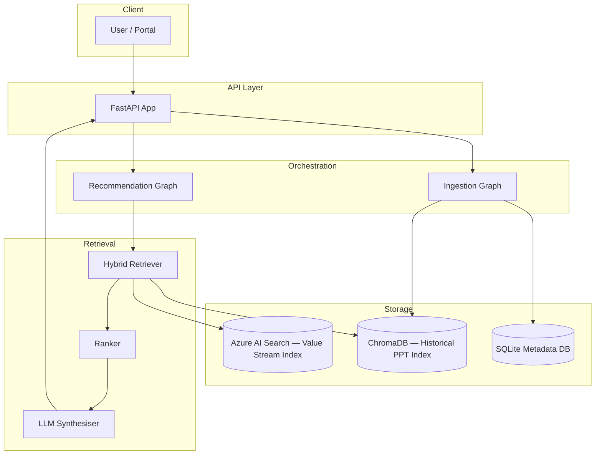
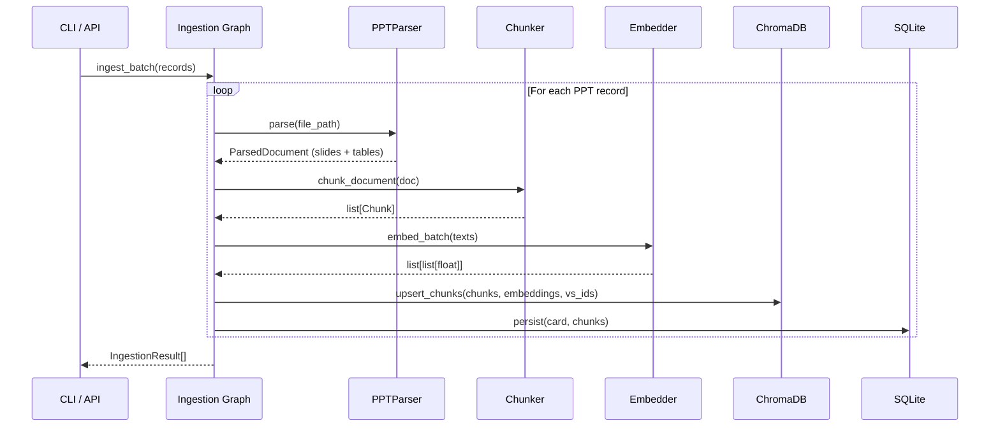
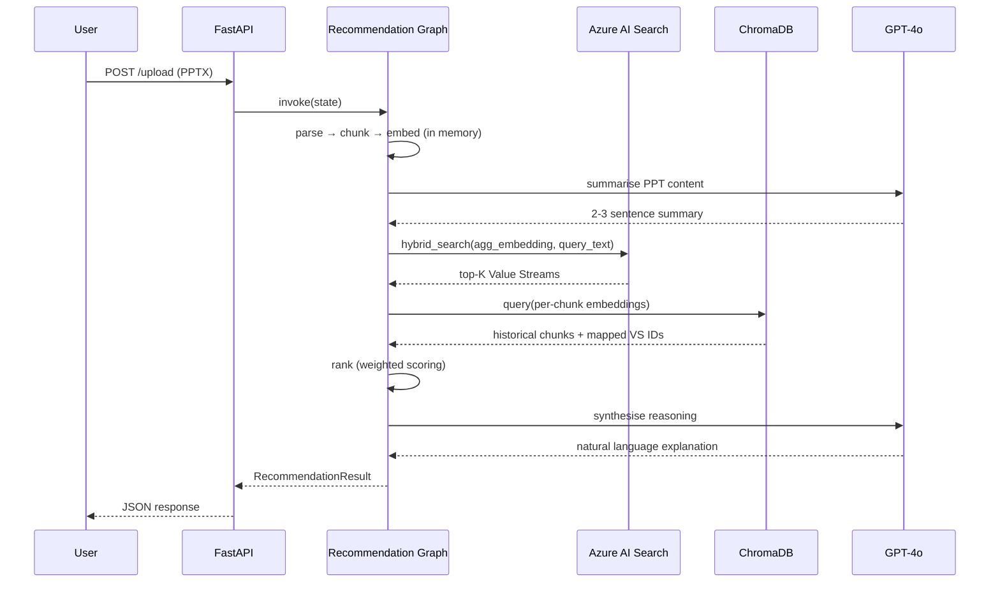
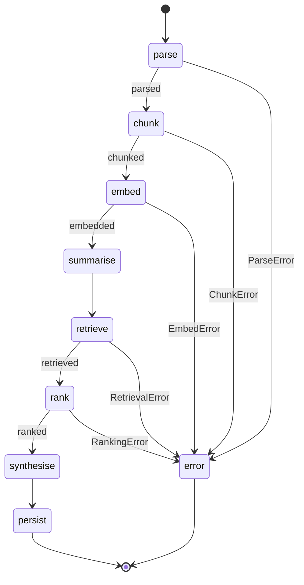
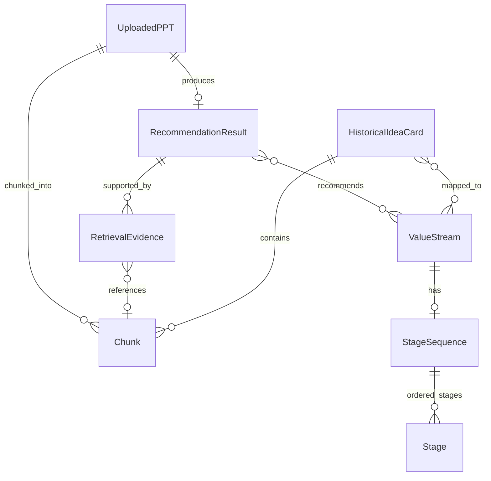

# Mermaid Diagram Reference

All diagrams in this system are authored as Mermaid.js markup and are embedded
in `ARCHITECTURE.md`. Below is a standalone reference with each diagram labelled.

---

## Diagram 1: System Architecture

---

## Diagram 2: Ingestion Flow

---

## Diagram 3: Runtime Recommendation Flow

---

## Diagram 4: LangGraph Workflow

---

## Diagram 5: Data Model Relationships

